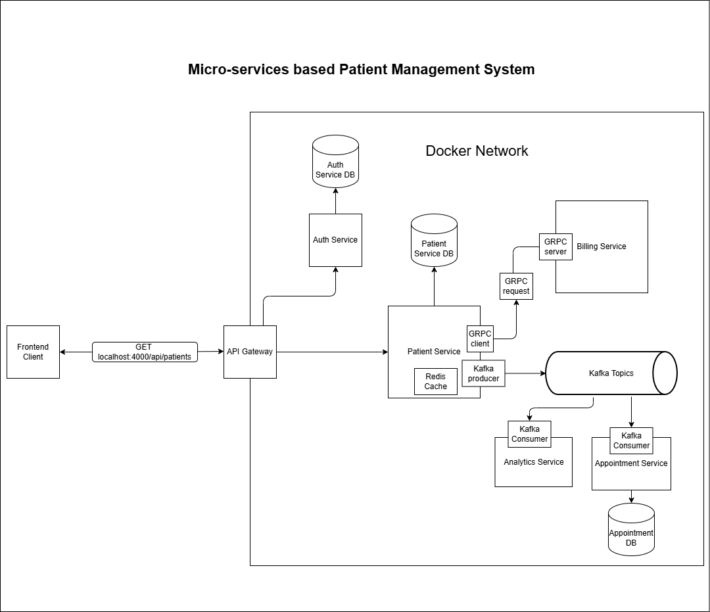

# Patient Management System

A multi-service patient management platform built with **Java 21**, **Spring Boot**, **Maven**, **PostgreSQL**, **Kafka**, **Redis**, and **AWS/CDK + LocalStack** for local infrastructure simulation.

This repository is organized as **separate Maven projects per service** rather than a single root aggregator build.

## Repository layout

- `api-gateway/` — Spring Cloud Gateway entry point and routing layer
- `auth-service/` — authentication, login, and token validation
- `patient-service/` — patient CRUD and related business logic
- `appointment-service/` — appointment management APIs
- `billing-service/` — billing service with REST + gRPC support
- `analytics-service/` — analytics/event processing service
- `infrastructure/` — AWS CDK / LocalStack infrastructure definitions
- `integration-tests/` — API/integration test suite
- `api-requests/` — sample HTTP requests for REST endpoints
- `grpc-requests/` — sample gRPC requests
- `monitoring/` — Prometheus configuration

## Services and ports

| Service | Port | Notes |
| --- | ---: | --- |
| `api-gateway` | `4004` | Routes requests to backend services |
| `auth-service` | `4005` | Login and token validation |
| `patient-service` | `4000` | Patient APIs |
| `appointment-service` | `4006` | Appointment APIs |
| `billing-service` | `4001` | REST endpoint |
| `billing-service` (gRPC) | `9001` | gRPC server port |

## Prerequisites

- Java 21
- Maven 3.9+ or the included Maven Wrapper in each service module
- Docker
- PostgreSQL
- Kafka
- Redis
- LocalStack + AWS CLI for the infrastructure deployment path

## Running locally

Because each module is independent, start the services from their own folders.

### Suggested startup order

1. Start infrastructure dependencies:
   - PostgreSQL
   - Kafka
   - Redis
   - LocalStack, if you are using the CDK/LocalStack path
2. Start `auth-service`
3. Start `patient-service`
4. Start `appointment-service`
5. Start `billing-service`
6. Start `analytics-service`
7. Start `api-gateway`

## Useful request samples

### Authentication

- `api-requests/auth-service/login.http`
- `api-requests/auth-service/validate.http`

### Patient service

- `api-requests/patient-service/create-patient.http`
- `api-requests/patient-service/get-patients.http`
- `api-requests/patient-service/update-patient.http`
- `api-requests/patient-service/delete-patient.http`

### Appointment service

- `api-requests/appointment-service/get-appointment-by-date-range.http`

### Billing gRPC

- `grpc-requests/billing-service/create-billing-account.http`

## Example endpoints

### Auth

- `POST /auth/login`
- `GET /auth/validate`

### Patients

- `POST /api/patients`
- `GET /api/patients`
- `PUT /api/patients/{id}`
- `DELETE /api/patients/{id}`

### Billing gRPC

- `BillingService/CreateBillingAccount`

## LocalStack / infrastructure

The `infrastructure/` module contains the CDK stack and a LocalStack deployment script.

- LocalStack endpoint used by the script: `http://localhost:4566`
- Stack name: `patient-management`
- The deployment script expects a synthesized template at `infrastructure/cdk.out/localstack.template.json`

To deploy the stack, generate the CDK output first, then run the script in `infrastructure/`.

## Monitoring

Prometheus config is provided in `monitoring/prometheus.yml` and is currently configured to scrape `patient-service` at:

- `http://patient-service:4000/actuator/prometheus`

## Notes

- `api-gateway` uses Redis-based rate limiting.
- `billing-service` exposes both REST and gRPC.
- Sample requests in `api-requests/` are useful for testing the gateway routes end-to-end.
- If you are running services directly on your machine, use `localhost` ports from the table above; if you are running through LocalStack or container networking, use the hostnames configured in the request files and deployment scripts.

